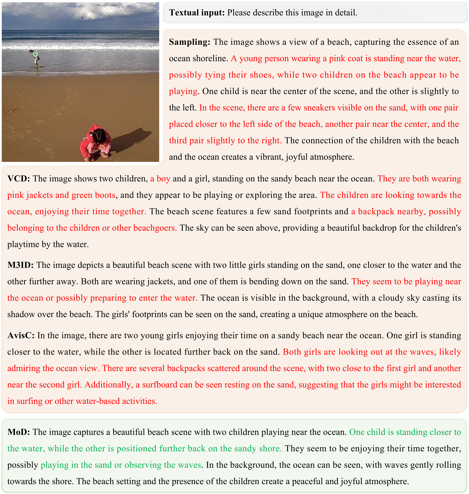

# Mixture of Decoding: An Attention-Inspired Adaptive Decoding Strategy to Mitigate Hallucinations in Large Vision-Language Models [Findings of ACL 2025]

<p align="left">
  <a href="https://arxiv.org/abs/2505.17061"></a>
</p>

## 🚀 Overview
<figure>
  
  <figcaption>
    <strong>Figure 1: Overview of our proposed MoD.</strong> 
    MoD involves three key steps: (1) extracting the model's attended image tokens while masking the others; (2) generating vanilla output logits from both original image tokens and masked image tokens; and (3) computing the JS divergence between the two logit distributions to assess the correctness of the model's attention. Based on this evaluation, MoD adaptively adopts either complementary or contrastive decoding strategies to produce hallucination-free outputs. The upper and lower panels illustrate cases of right and wrong attention, respectively. The corresponding attended image, visualized using LLaVA-1.5, is displayed in the lower left corner of each panel.
  </figcaption>
</figure>

## 🛠️ Setup

```bash
conda create MoD python=3.10
conda activate MoD
cd MoD
pip install -r requirements.txt
```

## 📈 Experiments
### Obtaining Model Responses
Here, we demonstrate how to obtain model responses using POPE as an example. The implementation for other benchmarks follows a similar approach.
```
cd experiments/POPE
python run_pope.py
```

### Evaluating Model Performance
```
python eval_pope.py --gen_files path_to_generations.jsonl --gt_files ./data/coco/coco_pope_random.json
```


## 🌰 Case Study
<figure>
  
  <figcaption>
    <strong>Figure 2: Case study of generative tasks using LLaVA-1.5.</strong> 
    We compare responses generated by sampling, VCD, M3ID, AvisC, and our proposed MoD. Hallucinated content is highlighted in <span style="color: #ff0000;">red</span>, while more detailed and accurate content is marked in <span style="color: #06b050;">green</span>.
  </figcaption>
</figure>

## 📜 Citation

If you find our work helpful for your research, please consider citing our work.   

```bibtex
TODO
```
